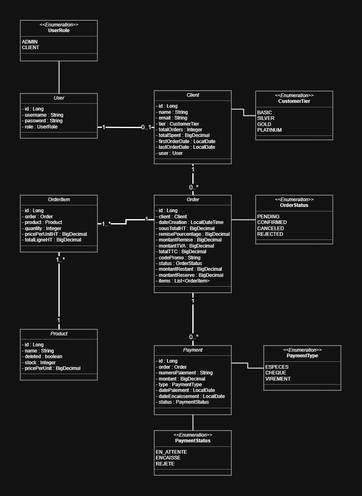
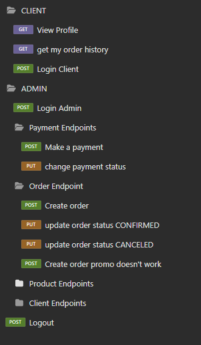

# 🛒 **SmartShop – Moroccan E-Commerce Platform**

## 📌 Project Description

**SmartShop** is a **Spring Boot 3** e-commerce platform built in **Java 17+**, designed to simulate a realistic Moroccan retail workflow with advanced payment management, credit reservation, and a dynamic customer loyalty system.

It emphasizes **accurate financial flows**, **fraud-resistant check handling**, and **clean domain-driven architecture** using DTOs, mappers, service interfaces, and custom business exceptions.

The system ensures correct real-money tracking by distinguishing between:

* 💵 **Instant payments** (cash — limited to 20 000 DH)
* 🏦 **Bank transfers**
* 🧾 **Checks** (with credit reservation + status validation)

Only **confirmed (encaissé)** payments impact customer spending and trigger tier upgrades.

---

## 🎯 Main Objectives

* Manage clients, products, orders, order items, and payments
* Support **partial payments** and **deferred check processing**
* Protect finances using **montantReserve** for pending checks
* Enforce business rules (cash limit, over-payment prevention, status transitions)
* Maintain **accurate customer statistics** (orders, spending, tier)
* Provide **secure role-based access** (ADMIN / CLIENT)
* Ensure reliability with strict validation and French business error messages

---

## 🔗 Useful Links

* 📂 [GitHub Repository](https://github.com/Ibrahim-Nidam/Croise_SmartShop)
* 📝 [Jira Board](https://ibrahimnidam-22.atlassian.net/jira/software/projects/SMAR/boards/298?atlOrigin=eyJpIjoiNWNmODdhNjNiMDZlNGI5ZjljMjcyYWI3MWI5MDY2NWMiLCJwIjoiaiJ9)
---

## 🛠️ Technologies Used

* **Java 17+**
* **Spring Boot 3**
* **Spring Data JPA**
* **Spring Security + JWT**
* **MapStruct** for DTO mapping
* **PostgreSQL** (prod) / **H2** (dev)
* **Lombok**
* **OpenAPI** for API documentation
* **JUnit 5 & Mockito**

---

## 🧩 Core Functionalities

✅ Complete order lifecycle: **PENDING → CONFIRMED / CANCELED**

✅ Multi-payment support per order

✅ Fraud-proof **credit reservation** for check payments

✅ Payment status flow: **EN_ATTENTE → ENCAISSE / REJETE**

✅ Real-money tracking: spending & tier affected **only on encaissé**

✅ Cash payments limited to **20 000 DH**

✅ Automatic order confirmation when **montantRestant ≤ 0**

✅ Loyalty tiers: **BASIC → SILVER → GOLD → PLATINUM**

✅ Secure role-based actions (ADMIN-only for sensitive operations)

✅ Consistent BigDecimal handling across payment logic

---

## 📂 Project Structure

```
smartshop/
│
├── pom.xml
├── README.md
│
├── src/
│   ├── main/
│   │   ├── java/ma/microtech/smartshop/
│   │   │   ├── SmartShopApplication.java
│   │   │
│   │   │   ├── config/
│   │   │   │   ├── AppConfig.java
│   │   │   │   ├── WebConfig.java
│   │   │   │   └── DataInitializer.java
│   │   │
│   │   │   ├── controller/
│   │   │   │   ├── AuthController.java
│   │   │   │   ├── ClientController.java
│   │   │   │   ├── ProductController.java
│   │   │   │   ├── OrderController.java
│   │   │   │   └── PaymentController.java
│   │   │
│   │   │   ├── dto/
│   │   │   │   ├── client/
│   │   │   │   ├── product/
│   │   │   │   ├── order/
│   │   │   │   ├── orderItem/
│   │   │   │   └── payment/
│   │   │
│   │   │   ├── entity/
│   │   │   │   ├── Client.java
│   │   │   │   ├── Product.java
│   │   │   │   ├── Order.java
│   │   │   │   ├── OrderItem.java
│   │   │   │   ├── Paiement.java
│   │   │   │   └── User.java
│   │   │
│   │   │   ├── enums/
│   │   │   │   ├── CustomerTier.java
│   │   │   │   ├── OrderStatus.java
│   │   │   │   ├── PaymentStatus.java
│   │   │   │   ├── PaymentType.java
│   │   │   │   └── UserRole.java
│   │   │
│   │   │   ├── exception/
│   │   │   │   ├── BusinessException.java
│   │   │   │   ├── UnauthorizedException.java
│   │   │   │   ├── ForbiddenException.java
│   │   │   │   ├── NotFoundException.java
│   │   │   │   └── GlobalExceptionHandler.java
│   │   │
│   │   │   ├── filter/
│   │   │   │   └── SessionAuthInterceptor.java
│   │   │
│   │   │   ├── mapper/
│   │   │   │   ├── ClientMapper.java
│   │   │   │   ├── ProductMapper.java
│   │   │   │   ├── OrderMapper.java
│   │   │   │   ├── OrderItemMapper.java
│   │   │   │   └── PaymentMapper.java
│   │   │
│   │   │   ├── repository/
│   │   │   │   ├── ClientRepository.java
│   │   │   │   ├── ProductRepository.java
│   │   │   │   ├── OrderRepository.java
│   │   │   │   ├── OrderItemRepository.java
│   │   │   │   ├── PaiementRepository.java
│   │   │   │   └── UserRepository.java
│   │   │
│   │   │   ├── service/
│   │   │   │   ├── interfaces/
│   │   │   │   └── impl/
│   │   │
│   │   └── resources/
│   │       ├── application.yml
│   │       └── application-dev.yml
│   │
│   └── test/
│       └── java/ma/microtech/smartshop/
│           ├── SmartshopApplicationTests.java
│           ├── service/ClientServiceImplTest.java
│           └── service/ProductServiceImplTest.java
│
└── docs/
    └── (screenshots, postman collection, diagrams)

```

---

## ⚙️ Main Features

✔ Order creation with automatic stock deduction
✔ Partial & multi-payment flow
✔ Check handling with **montantReserve**
✔ Payment status updates: ENCAISSE / REJETE
✔ Client statistics: total orders, spending, tier
✔ Secure endpoints via JWT roles
✔ REST API with validation & French messages

---

## 📊 Architecture Diagram



---

## 📸 Application Screenshots




---

## 🔌 Key API Endpoints

| Action                | Method | URL                                | Role   |
| --------------------- | ------ | ---------------------------------- | ------ |
| Create order          | POST   | `/api/orders`                      | ADMIN  |
| Add payment to order  | POST   | `/api/payments/{orderId}/pay`      | CLIENT |
| Update payment status | PUT    | `/api/payments/{paymentId}/status` | ADMIN  |
| Get client details    | GET    | `/api/clients/{id}`                | ADMIN  |

### Example – Marking a check as *encaissé*

```json
{
  "status": "ENCAISSE",
  "dateEncaissement": "2025-11-27"
}
```

---

## 🧪 Run & Test

**Start application:**

```bash
  mvn spring-boot:run
```

**Run test suite:**

```bash
  mvn test
```


